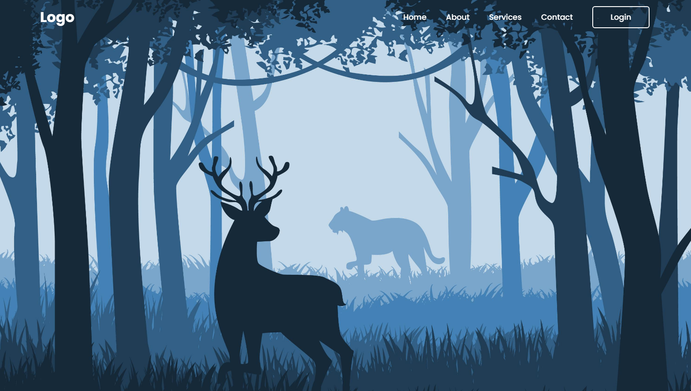
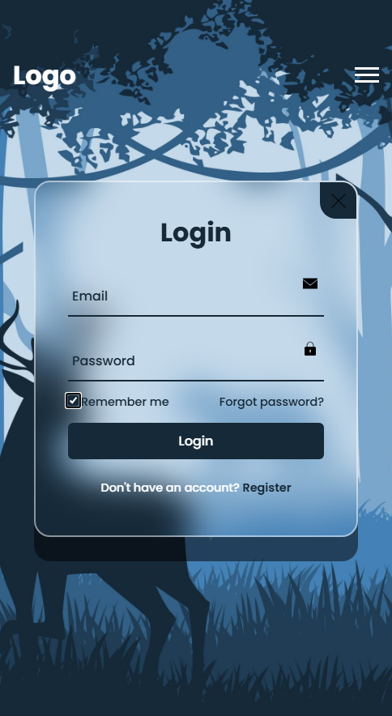

# Login and Register Form

## Descrição

Página de login e registro de contas interativa!

## Conceitos trabalhados e fixados no projeto:

* HTML Semântico; ✅
* Design Responsivo; ✅
* Estados e animações com CSS; ✅
* Página de login aparece apenas quando se clica no botão "Login"; ✅
* Troca de página entre login e registro de contas; ✅
* Botão "X" para fechar o container de login/registro; ✅
* Menu hambúrguer no Mobile com animação. ✅

## Tecnologias Utilizadas

* HTML; 🤖
* CSS; 🤖
* JavaScript. 🤖

## Design Desktop

    

## Design Mobile

    

